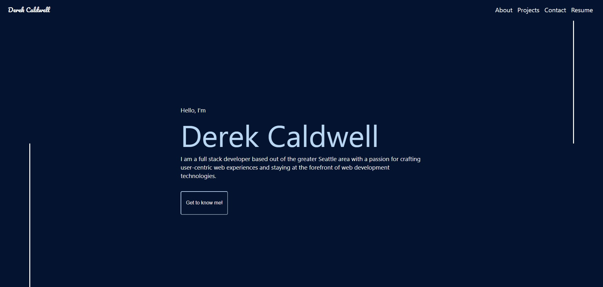
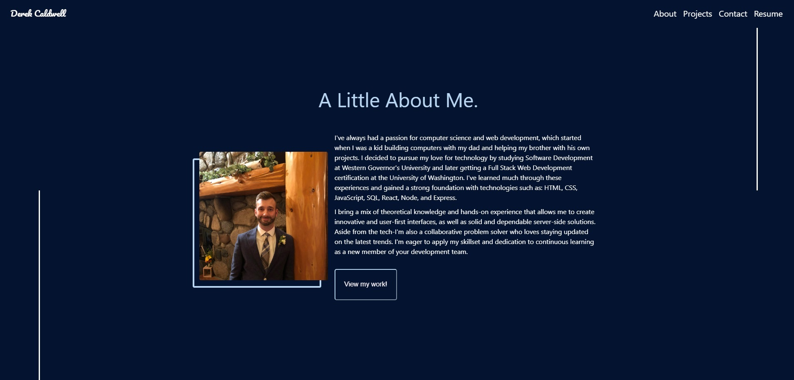
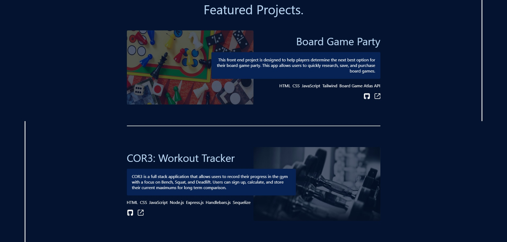

# Professional Portfolio

## Credit and Attribution
The inspiration behind this project was drawn from [Brittany Chiang's](https://github.com/bchiang7) work on her project [V4](https://github.com/bchiang7/v4), the now updated site can be found [here](https://brittanychiang.com/). When browsing portfolio examples I came across her work and eventually [V4](https://github.com/bchiang7/v4). I loved the project so much I wanted to challenge myself to build as much as I could of the website from scratch. Although I have built this website using my own code, the design is [Brittany's](https://github.com/bchiang7) and I do not claim the site as my own. I'm appreciative of the result so far and have learned much attempting to mimic the site.

I encourage you to check out more of [Brittany Chiang's](https://github.com/bchiang7) amazing work.

## TODO
Update Favicon

## Table of Contents
1. [Description](#description)
2. [Installation](#installation)
3. [Usage](#usage)
4. [Tests](#tests)
5. [License](#license)
6. [Questions](#questions)
7. [Media](#media)

## Description
This application is intended to showcase the projects that I have worked on either collaboratively or indenpendently. As of now, there are three featured projects that can be found under the Featured Projects section.

## Installation
The website can be viewed at the following [link.](www.google.com)

1. Clone the repository.
2. Run command: `npm install`
3. Run command: `npm start`

## Usage
This website can be used to quickly learn about my development background and view the work that I have completed so far.

## Tests
No test suites have been run at this time.

## License
This application is currently covered under the MIT License. More information about this license can be viewed under the file named 'LICENSE' in the repository.

## Questions
If you have any questions, feel free to reach out to me at my email: djohncaldwell@gmail.com

All of my work can be viewed at my GitHub profile: [CaldwellDerek](https://github.com/CaldwellDerek)

## Media

Hero

About

Projects

Contact
